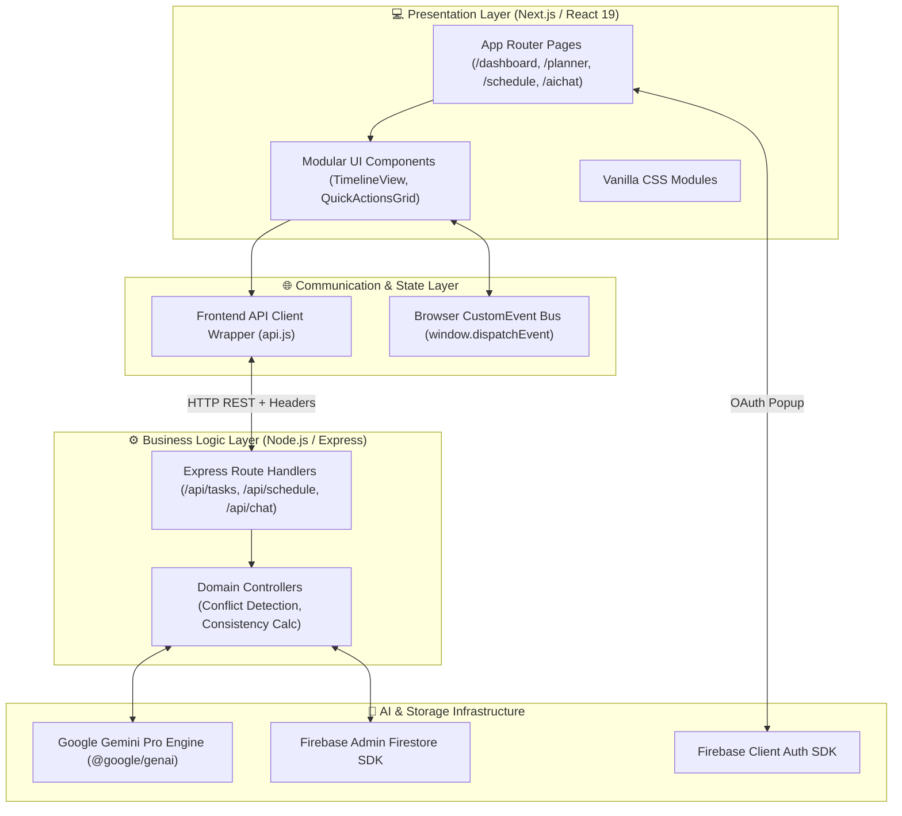
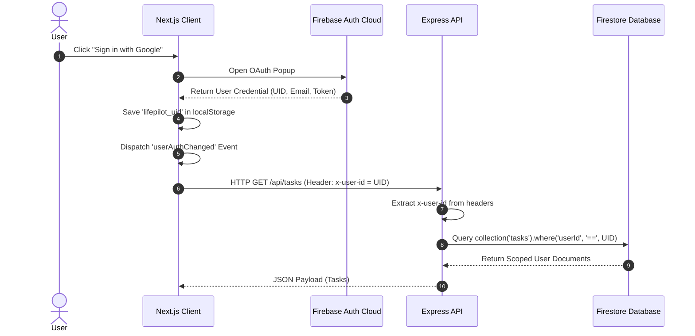
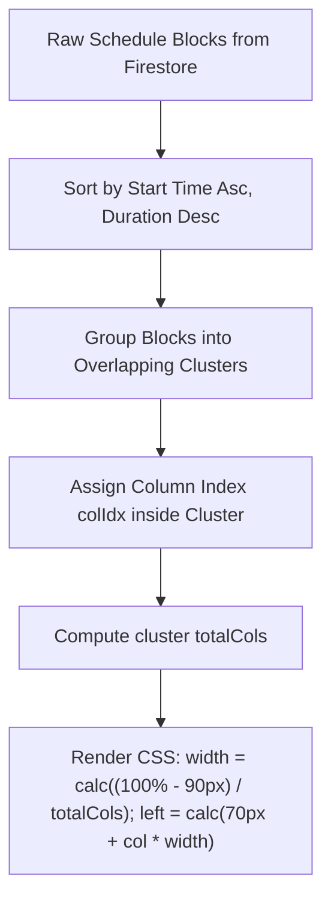
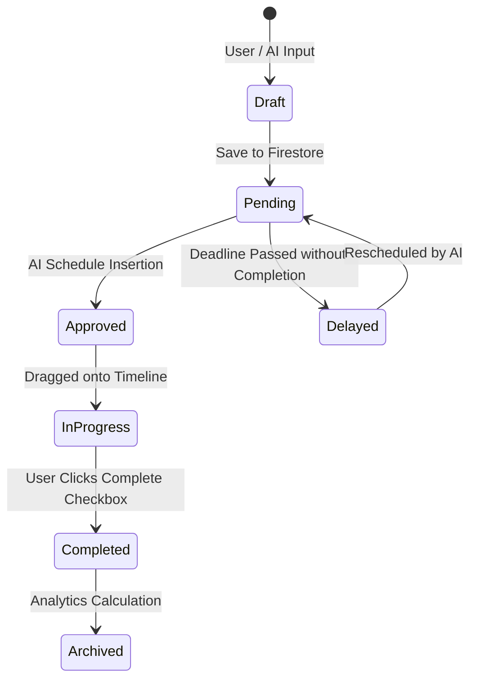
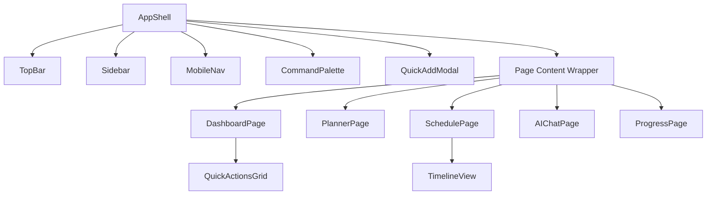
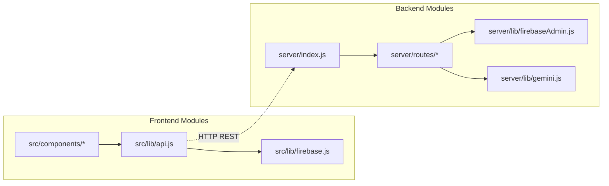
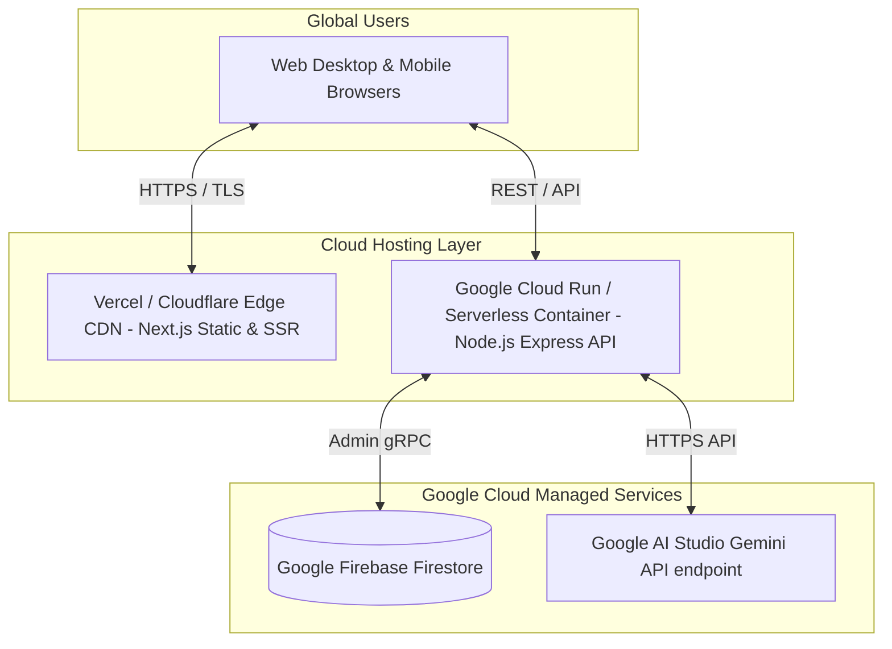

# System Architecture — LifePilot AI

This document provides a detailed technical specification of the software architecture, modular layering, data flow patterns, and integration strategies utilized in **LifePilot AI**.

---

## 📑 Table of Contents
1. [Executive Summary](#1-executive-summary)
2. [Design Philosophy](#2-design-philosophy)
3. [Layer Diagram](#3-layer-diagram)
4. [Frontend Architecture](#4-frontend-architecture)
5. [Backend Architecture](#5-backend-architecture)
6. [Firebase & Firestore Architecture](#6-firebase--firestore-architecture)
7. [Gemini AI Integration Engine](#7-gemini-ai-integration-engine)
8. [Authentication & Security Model](#8-authentication--security-model)
9. [Voice Processing Pipeline](#9-voice-processing-pipeline)
10. [Planner & Scheduling Architecture](#10-planner--scheduling-architecture)
11. [Task Lifecycle & State Flow](#11-task-lifecycle--state-flow)
12. [Component Dependency Graph](#12-component-dependency-graph)
13. [Module Dependency Diagram](#13-module-dependency-diagram)
14. [Deployment Architecture](#14-deployment-architecture)

---

## 1. Executive Summary

LifePilot AI is architected as a decoupled, full-stack web application designed to deliver real-time personal executive orchestration. The application separates user interface presentation (Next.js App Router) from business logic and database administration (Express API Server + Firebase Admin SDK), bridged by RESTful HTTP communication and real-time browser event buses. Intelligence is embedded directly into the controller layer via structured interactions with Google's Gemini Pro API.

---

## 2. Design Philosophy

1. **Separation of Concerns**: The frontend is strictly responsible for rendering state, capturing user interaction, and managing localized animations. Business rules, conflict detection algorithms, and prompt construction reside exclusively on the backend API.
2. **Predictable JSON Schemas**: To prevent hallucinations and UI fragility, all AI responses must conform to strict JSON schemas validated before being transmitted to the frontend.
3. **Optimistic UI with Event-Driven Sync**: When a user modifies a task or moves a schedule block, the local component immediately updates its visual state while dispatching window-level synchronization events (`taskUpdated`, `scheduleUpdated`) to inform sibling components.
4. **Strict Data Isolation**: Every Firestore query is explicitly bound to the authenticated user's ID (`x-user-id`), preventing accidental data leakage across multi-tenant sessions.

---

## 3. Layer Diagram



---

## 4. Frontend Architecture

The frontend is constructed using **Next.js 16.2.9** leveraging the modern **App Router** (`src/app/`). Styling is implemented using **Vanilla CSS Modules** (`*.module.css`) to maintain zero-runtime CSS overhead and complete encapsulation without design system lock-in.

### Key Layout Shells
* **`AppShell.js`**: The root dashboard wrapper. It listens to path navigation, intercepts unauthenticated users redirecting them to `/login`, and coordinates modal overlays (Command Palette, Quick Add Modal).
* **`TopBar.js`**: Displays user authentication status, consistency badges, and provides seamless profile dropdown navigation and logout functionality.
* **`Sidebar.js` & `MobileNav.js`**: Responsive navigation routing users between Executive Overview, Planner, Schedule, Goals, AI Assistant, and Settings.

---

## 5. Backend Architecture

The backend is structured as an independent **Node.js Express** server (`server/index.js`) listening on port 5000. It utilizes middleware for CORS handling and JSON body parsing.

### Route Module Breakdown
* **`routes/tasks.js`**: Handles CRUD operations for manual tasks. Implements recurring logic generation and basic deadline conflict assessment against existing calendar blocks.
* **`routes/schedule.js`**: Manages daily timeline schedule blocks. Supports queries by date (`/today`), drag-and-drop time adjustments, and direct block modifications.
* **`routes/chat.js`**: Receives user conversation prompts and system state context. Formulates strict system instructions for Gemini Pro, parses incoming JSON AI responses, and executes batch write approvals.
* **`routes/insights.js`**: Calculates the real-time **Consistency Score** (0–100%) by analyzing completed tasks, pending deadlines, habit completion percentages, and active daily streaks.
* **`routes/goalsHabits.js`**: Manages long-term executive goals and recurring daily habit trackers.

---

## 6. Firebase & Firestore Architecture

Database operations are split between client-side authentication and server-side privileged data manipulation:
* **Client Side (`src/lib/firebase.js`)**: Initializes the Firebase Client SDK strictly for Google OAuth Sign-In via `signInWithPopup`.
* **Server Side (`server/lib/firebaseAdmin.js`)**: Initializes the Firebase Admin SDK using service account credentials. All database reads and writes occur via admin privileges scoped securely by the user ID header.

---

## 7. Gemini AI Integration Engine

The AI engine (`server/lib/gemini.js`) integrates the `@google/genai` SDK. When a chat request arrives:
1. **Context Aggregation**: The backend fetches pending tasks and today's schedule from Firestore.
2. **Prompt Construction**: A detailed executive instruction prompt is concatenated with the user's request and the serialized Firestore context.
3. **Schema Enforcement**: The prompt mandates that Gemini reply exclusively in validated JSON conforming to structure:
   ```json
   {
     "reply": "Conversational explanation...",
     "proposedSchedule": [...blocks],
     "proposedTasks": [...tasks]
   }
   ```
4. **Validation & Fallback**: The server attempts JSON parsing. If invalid, error handling prevents server crash and prompts UI retry.

---

## 8. Authentication & Security Model



---

## 9. Voice Processing Pipeline

To enable hands-free interaction, the frontend implements standard HTML5 **Web Speech API** interfaces:
* **Speech Recognition (`webkitSpeechRecognition`)**: Captures spoken audio from the user's microphone, converts it into real-time text transcriptions, and injects the text into the AI Assistant input prompt.
* **Speech Synthesis (`window.speechSynthesis`)**: Converts textual AI responses into natural spoken audio feedback, providing confirmation when schedules are replanned.

---

## 10. Planner & Scheduling Architecture

The scheduling subsystem prevents timeline collisions through a multi-tier algorithm:



This mathematical partitioning guarantees that simultaneous meetings or study tasks render side-by-side cleanly without obscuring action buttons.

---

## 11. Task Lifecycle & State Flow



---

## 12. Component Dependency Graph



---

## 13. Module Dependency Diagram



---

## 14. Deployment Architecture


