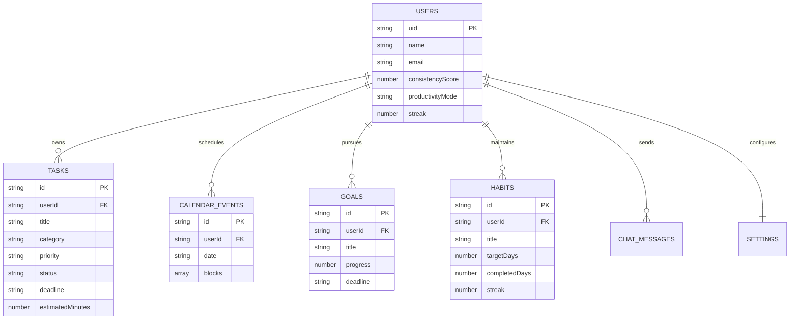
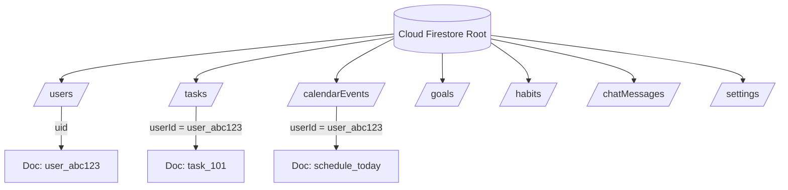
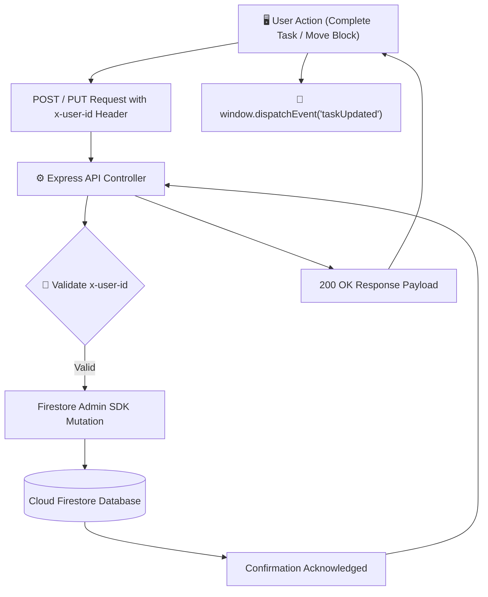

# Database Schema Specification — LifePilot AI

This document details the NoSQL database design implemented in **Google Cloud Firestore** for **LifePilot AI**. It defines entity structures, data types, indexing rules, and synchronization patterns across all active collections.

---

## 📑 Table of Contents
1. [Firestore Architecture Overview](#1-firestore-architecture-overview)
2. [Entity Relationship Diagram (ERD)](#2-entity-relationship-diagram-erd)
3. [Database Relationship Diagram](#3-database-relationship-diagram)
4. [Collection Specifications](#4-collection-specifications)
   - [`users` Collection](#users-collection)
   - [`tasks` Collection](#tasks-collection)
   - [`calendarEvents` Collection](#calendarevents-collection)
   - [`goals` Collection](#goals-collection)
   - [`habits` Collection](#habits-collection)
   - [`chatMessages` Collection](#chatmessages-collection)
   - [`settings` Collection](#settings-collection)
5. [Data Flow Diagram](#5-data-flow-diagram)
6. [Synchronization Strategy](#6-synchronization-strategy)

---

## 1. Firestore Architecture Overview

LifePilot AI utilizes a multi-tenant, root-collection schema in Google Cloud Firestore. Because Firestore is a schemaless NoSQL document store, structural consistency and user boundary scoping (`userId`) are enforced programmatically within the Node.js Express data access layer.

---

## 2. Entity Relationship Diagram (ERD)



---

## 3. Database Relationship Diagram



---

## 4. Collection Specifications

### `users` Collection
* **Purpose**: Stores core user identity, cumulative consistency ratings, and current productivity operating modes.
* **Indexes**: Primary key lookup on document ID (`uid`).
* **Example Document**:
```json
{
  "uid": "user_abc123xyz",
  "name": "Pranav Raut",
  "email": "pranav@lifepilot.ai",
  "consistencyScore": 92,
  "productivityMode": "Deep Focus",
  "streak": 5,
  "createdAt": "2026-06-28T10:00:00.000Z"
}
```

---

### `tasks` Collection
* **Purpose**: Houses actionable items generated manually via the Planner or autonomously via AI chat.
* **Fields & Types**:
  * `userId` (`string`): Foreign key matching `users.uid`.
  * `title` (`string`): Brief task description.
  * `priority` (`string`): `'P1' | 'P2' | 'P3'`.
  * `status` (`string`): `'pending' | 'approved' | 'completed'`.
  * `deadline` (`string`): ISO Date `YYYY-MM-DD`.
* **Example Document**:
```json
{
  "id": "task_9942",
  "userId": "user_abc123xyz",
  "title": "Prepare Hackathon Demo Video",
  "category": "Submission",
  "priority": "P1",
  "status": "pending",
  "deadline": "2026-06-30",
  "estimatedMinutes": 120,
  "createdAt": "2026-06-29T06:00:00.000Z"
}
```

---

### `calendarEvents` Collection
* **Purpose**: Stores daily timeline itineraries. To optimize read operations, blocks for a specific date are embedded within a single date document.
* **Example Document**:
```json
{
  "id": "user_abc123xyz_2026-06-29",
  "userId": "user_abc123xyz",
  "date": "today",
  "blocks": [
    {
      "id": "blk_1",
      "title": "System Review Meeting",
      "startTime": "10:00",
      "endTime": "11:00",
      "type": "meeting",
      "why": "Scheduled morning standup."
    }
  ],
  "updatedAt": "2026-06-29T06:45:00.000Z"
}
```

---

### `goals` Collection
* **Purpose**: Tracks macro-level executive objectives.
* **Example Document**:
```json
{
  "id": "goal_771",
  "userId": "user_abc123xyz",
  "title": "Win Vibe2Ship Hackathon",
  "category": "Career",
  "progress": 85,
  "deadline": "2026-06-30"
}
```

---

### `habits` Collection
* **Purpose**: Records recurring daily practices and streak momentum.
* **Example Document**:
```json
{
  "id": "habit_332",
  "userId": "user_abc123xyz",
  "title": "Algorithm Practice",
  "targetDays": 7,
  "completedDays": 6,
  "streak": 14
}
```

---

### `chatMessages` Collection
* **Purpose**: Retains conversational history between the user and Gemini AI to maintain multi-turn prompt awareness.
* **Example Document**:
```json
{
  "id": "msg_551",
  "userId": "user_abc123xyz",
  "role": "assistant",
  "text": "I have replanned your afternoon schedule.",
  "timestamp": "2026-06-29T11:20:00.000Z"
}
```

---

### `settings` Collection
* **Purpose**: Stores user-specific API toggles and UI parameters.
* **Example Document**:
```json
{
  "userId": "user_abc123xyz",
  "googleCalendarConnected": false,
  "peakFocusHours": "09:00 - 11:00",
  "burnoutThresholdHours": 5
}
```

---

## 5. Data Flow Diagram



---

## 6. Synchronization Strategy

To ensure seamless multi-component reactivity without incurring database polling throttling:
1. **Optimistic UI Execution**: When a user marks a task complete or drags a calendar block, the frontend updates React state instantaneously.
2. **Asynchronous Cloud Write**: A network mutation is dispatched to Firestore in the background.
3. **Event Bus Broadcast**: Upon completion, custom window events broadcast changes across all mounted components, keeping the Planner, Calendar, and Consistency Score metrics perfectly aligned.
