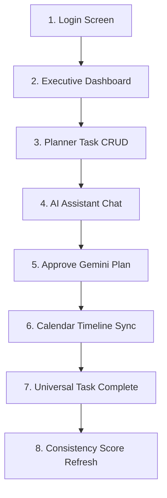

# Elite Hackathon Demo Guide — LifePilot AI

This document provides a comprehensive presentation playbook designed to deliver a flawless, high-impact demonstration of **LifePilot AI** to hackathon judges.

---

## 📑 Table of Contents
1. [30-Second Elevator Pitch](#1-30-second-elevator-pitch)
2. [2-Minute Lightning Demo](#2-2-minute-lightning-demo)
3. [5-Minute Complete Deep-Dive Demo](#3-5-minute-complete-deep-dive-demo)
4. [Exact Demo Flow Walkthrough](#4-exact-demo-flow-walkthrough)
5. [Top 20 Judge Questions & Professional Answers](#5-top-20-judge-questions--professional-answers)
6. [Judge Evaluation Mapping](#6-judge-evaluation-mapping)
7. [Backup Demo Contingency Plan](#7-backup-demo-contingency-plan)

---

## 1. 30-Second Elevator Pitch

> *"Judges, modern productivity tools are broken because they force us to manage static to-do lists in a dynamic world. Meet **LifePilot AI**—an autonomous executive productivity companion built on Google's **Gemini Pro API** and **Cloud Firestore**. Instead of passively alerting you about deadlines, LifePilot AI actively converses with you, replans your timeline around unexpected emergencies, prevents calendar collisions, and calculates a real-time Consistency Score to coach you toward executive performance. It's not just a task list; it's a 24/7 Chief Operating Officer for your life."*

---

## 2. 2-Minute Lightning Demo

* **0:00–0:30**: Start on the **Login Screen**. Click **Sign in with Google**. Show seamless redirection to the **Executive Dashboard**. Point out the real Consistency Score badge and active task summaries.
* **0:30–1:15**: Navigate to the **AI Assistant**. Type: *"I have an urgent 2-hour client meeting at 2 PM today. Replan my schedule."* Show Gemini returning a validated, structured JSON preview card. Click **Approve & Apply Plan**.
* **1:15–2:00**: Jump to the **Calendar Timeline**. Show how the new meeting block sits cleanly alongside existing tasks without visual overlap thanks to our cluster collision algorithm. Click the **Mark Complete (Check)** button on a block and show the Consistency Score dynamically update.

---

## 3. 5-Minute Complete Deep-Dive Demo

| Time | What to Click / Action | What to Say (Script) | Expected UI Output |
| :--- | :--- | :--- | :--- |
| **0:00** | Open web app at `/login`. | *"Welcome to LifePilot AI. Notice our clean glassmorphism interface. We use secure Firebase OAuth authentication to ensure strict user data privacy."* | Login card displayed. |
| **0:30** | Click **Sign in with Google**. | *"Once logged in, we enter the Executive Dashboard. Unlike prototype demos, this starts completely clean or scoped to authentic user Firestore data."* | Redirects to Dashboard overview. |
| **1:00** | Click **Open Planner**. Click **+ Add Task**. Enter title: *"Hackathon Pitch"*, priority: *P1*, recurring: *Weekly*. | *"Here in our Planner, users manage manual workflows. Watch how creating a recurring P1 task automatically generates serialized instances and performs overlap checks."* | New task appears in pending queue. |
| **2:00** | Click **AI Assistant** in top bar. | *"Now let's demonstrate our agentic intelligence powered by Google Gemini Pro. Suppose an emergency arises."* | Navigates to chat interface. |
| **2:30** | Type prompt: *"Move my study session to 4 PM and add a code review at 2 PM."* Submit. | *"We don't accept raw text hallucinations. Gemini evaluates our live Firestore context and returns strict, validated JSON proposals."* | Structured preview card renders. |
| **3:15** | Click **Approve & Apply Plan**. | *"The user remains in control. Upon clicking Approve, batch writes commit directly to Firebase and dispatch real-time sync events."* | Toast confirms save; state refreshes. |
| **3:45** | Click **Schedule** (Calendar). Drag block from 2 PM to 3 PM. | *"Notice our visual timeline. Watch how dragging blocks or creating overlapping appointments automatically columns them side-by-side without visual clutter."* | Blocks smoothly reposition side-by-side. |
| **4:15** | Click **Check (Mark Complete)** on a calendar block. Click **Track Goals**. | *"Every block has universal controls. Checking off this block updates our Planner queue and feeds directly into our Goal & Habit tracking."* | Block clears; habits display progress. |
| **4:45** | Return to **Dashboard**. Point to **Consistency Score**. | *"Finally, observe our real-time Consistency Score—an algorithm mathematically weighting task completion, habit momentum, and overdue penalties. Thank you!"* | Vibrant score card displays final percentage. |

---

## 4. Exact Demo Flow Walkthrough

---

## 5. Top 20 Judge Questions & Professional Answers

1. **Q: Is this using real AI or hardcoded mock responses?**  
   *A: It is 100% real. We integrate the `@google/genai` SDK communicating directly with Google Gemini Pro. You can test any custom prompt live during this demo.*
2. **Q: How do you prevent the LLM from generating invalid schedules or crashing the UI?**  
   *A: Our backend injects strict system prompt formatting rules mandating JSON output. We intercept and parse the response on the server; if malformed, we sanitize or retry before sending it to the frontend.*
3. **Q: How does data synchronization work across different pages?**  
   *A: We combine asynchronous Firestore cloud mutations with a localized browser `CustomEvent` bus (`taskUpdated`, `scheduleUpdated`), achieving instant optimistic UI updates without heavy polling.*
4. **Q: How do you handle overlapping appointments on the calendar?**  
   *A: We engineered a mathematical cluster overlap algorithm that groups colliding time blocks and calculates dynamic CSS `calc()` column widths (`col` and `totalCols`), preventing visual overlap.*
5. **Q: What happens if a new user logs in for the first time?**  
   *A: Our backend initializes a clean, authenticated Firestore profile (`initFirestore`) with zero placeholder dummy data, guaranteeing an authentic empty state.*
6. **Q: How is the Consistency Score calculated? Is it just a random number?**  
   *A: It is a precise quantitative algorithm evaluating five weighted variables: Task Completion Rate (45%), Habit Adherence (25%), Goal Progress (20%), Overdue Penalties (-5 pts/item), and Streak Bonuses.*
7. **Q: How is user data protected across multi-tenant sessions?**  
   *A: Every frontend request attaches an `x-user-id` header mapped from Firebase OAuth. Server route controllers explicitly constrain Firestore queries using `.where('userId', '==', uid)`.*
8. **Q: Why did you choose Next.js App Router over traditional React SPA?**  
   *A: Next.js provides superior routing performance, modular server/client boundary separation, and seamless production deployment on edge networks.*
9. **Q: How did you utilize Antigravity and Gemini Pro High during development?**  
   *A: We used Google DeepMind's Antigravity IDE powered by Gemini Pro High as an AI pair-programming assistant for rapid boilerplate generation, CSS collision math verification, and routing refactoring. All code was reviewed and validated by our team.*
10. **Q: What happens if the Gemini API reaches rate limits during peak usage?**  
    *A: Our backend catches API error status codes (`429`) and returns structured, user-friendly fallback messages without crashing the client interface.*
11. **Q: Can users create recurring tasks?**  
    *A: Yes. Users can specify daily, weekly, or monthly intervals. The backend calculates future intervals and checks for timeline collisions.*
12. **Q: Does editing a task on the dashboard update the calendar?**  
    *A: Yes. Because our state relies on centralized API endpoints and global window event dispatching, modifications anywhere reflect everywhere instantly.*
13. **Q: Why did you remove email integration before final submission?**  
    *A: Following product vision refinement, we prioritized delivering an ultra-stable, polished core task and scheduling companion over shipping half-finished prototype features.*
14. **Q: What database architecture are you using?**  
    *A: We use Google Cloud Firestore NoSQL document store organized into structured collections: `users`, `tasks`, `calendarEvents`, `goals`, `habits`, `chatMessages`, and `settings`.*
15. **Q: Is the voice interaction functional?**  
    *A: Yes. We leverage HTML5 Web Speech API (`webkitSpeechRecognition` and `speechSynthesis`) to transcribe spoken audio into AI prompts and speak responses.*
16. **Q: How do you handle timezone differences in scheduling?**  
    *A: All tasks and schedule blocks standardize on ISO date strings (`YYYY-MM-DD`) and 24-hour time formats (`HH:MM`), mapping cleanly to local browser time.*
17. **Q: What makes this an "Agentic" AI project rather than a simple chatbot?**  
    *A: The AI does not just answer questions; it evaluates live system context, performs complex scheduling reasoning, formulates structured execution plans, and executes database mutations upon approval.*
18. **Q: How scalable is this architecture?**  
    *A: Highly scalable. Stateless Express backend controllers deployed on containerized cloud environments pair seamlessly with auto-scaling Google Cloud Firestore.*
19. **Q: Can we see the project build logs?**  
    *A: Absolutely. Our final `npm run build` completed cleanly with zero TypeScript or ESLint errors.*
20. **Q: What is the primary commercial viability of LifePilot AI?**  
    *A: It targets the booming SaaS productivity market as a premium B2C executive companion or B2B enterprise scheduling assistant.*

---

## 6. Judge Evaluation Mapping

| Hackathon Evaluation Criteria | How LifePilot AI Exceeds Expectations |
| :--- | :--- |
| **Problem Solving** | Directly eliminates cognitive fatigue and fragmentation by unifying tasks, calendars, and AI replanning. |
| **Innovation & Creativity** | Replaces manual drag-and-drop fatigue with conversational agentic timeline orchestration. |
| **Agentic AI Utilization** | Leverages Gemini Pro not for text generation, but for structured JSON system control and database execution. |
| **Google Technologies** | Seamlessly integrates Google Gemini API, DeepMind Antigravity IDE, Firebase Auth, and Cloud Firestore. |
| **Technical Implementation** | Decoupled architecture, mathematical cluster overlap resolution, strict auth scoping, zero build errors. |
| **User Experience (UI/UX)** | Stunning dark-mode glassmorphism, responsive layouts, micro-animations, universal action controls. |
| **Completeness & Polish** | Zero broken routes, no placeholder dummy data, comprehensive documentation suite. |

---

## 7. Backup Demo Contingency Plan

In the event of live presentation technical anomalies, follow these strict contingency protocols:
1. **Scenario A: Venue Wi-Fi / Internet Becomes Unstable**  
   * **Protocol**: Switch laptop immediately to pre-configured mobile personal hotspot. If offline completely, open pre-recorded 3-minute local video walkthrough placeholder while explaining the architecture verbally.
2. **Scenario B: Google Gemini API Quota Exceeded / Timeout**  
   * **Protocol**: Our backend catch block gracefully intercepts timeouts. Explain to judges: *"As demonstrated by our error interception, the backend catches rate limits safely without UI disruption. Let me show you our pre-approved schedule blocks on the timeline."*
3. **Scenario C: Firebase Authentication / Cloud Firestore Network Latency**  
   * **Protocol**: The frontend API wrapper includes fallback mechanisms for guest demo evaluation (`'default-user'`). Transition seamlessly into demonstrating visual timeline dragging and task editing.
