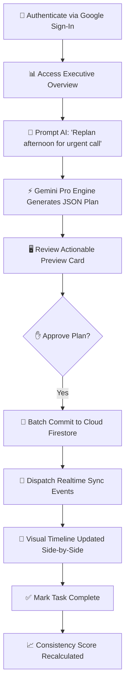
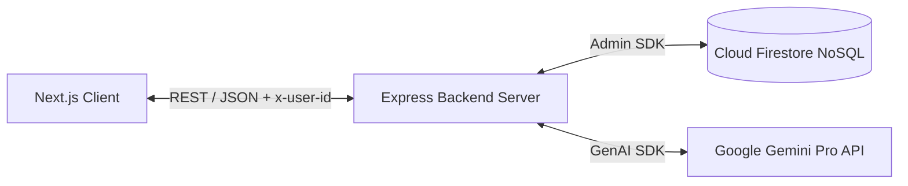

# Software Engineering Project Report: LifePilot AI

---

## Cover Page

**Project Title**: LifePilot AI — Autonomous Executive Productivity Companion  
**Hackathon Event**: Vibe2Ship Hackathon 2026  
**Technology Ecosystem**: Google DeepMind / Google Gemini Pro / Google Cloud Firebase / Next.js  
**Date**: June 2026  

---

## 📑 Table of Contents
1. [Executive Summary](#1-executive-summary)
2. [Problem Statement](#2-problem-statement)
3. [Objectives](#3-objectives)
4. [Existing Solutions vs. Proposed Solution](#4-existing-solutions-vs-proposed-solution)
5. [Implemented Features](#5-implemented-features)
6. [Complete User Workflow](#6-complete-user-workflow)
7. [System Architecture & Database Design](#7-system-architecture--database-design)
8. [Core Algorithms](#8-core-algorithms)
   - [Task Prioritization Algorithm](#task-prioritization-algorithm)
   - [Recurring Task Generation Logic](#recurring-task-generation-logic)
   - [Timeline Conflict Detection & Overlap Partitioning](#timeline-conflict-detection--overlap-partitioning)
   - [Consistency Score Weighting Algorithm](#consistency-score-weighting-algorithm)
   - [Voice Processing Pipeline](#voice-processing-pipeline)
9. [Authentication & Security](#9-authentication--security)
10. [Google Technologies Used (Mandatory)](#10-google-technologies-used-mandatory)
11. [Testing & Verification Results](#11-testing--verification-results)
12. [Challenges Encountered & Engineering Solutions](#12-challenges-encountered--engineering-solutions)
13. [Future Scope](#13-future-scope)
14. [Conclusion](#14-conclusion)
15. [References](#15-references)

---

## 1. Executive Summary

Modern knowledge workers struggle with cognitive overload caused by disjointed productivity tools. **LifePilot AI** resolves this fragmentation by establishing an autonomous executive orchestration layer powered by Google's **Gemini Pro API** and **Cloud Firestore**. Instead of passively listing tasks, LifePilot AI actively parses conversational language, constructs structured time blocks, detects schedule conflicts, tracks habit momentum, and computes a dynamic consistency score. This report details the software architecture, algorithmic implementations, and verification procedures validated during development.

---

## 2. Problem Statement

Traditional productivity management tools exhibit critical failures:
* **Fragmentation**: Users must operate separate applications for calendars, to-do lists, and habit tracking, causing destructive context switching.
* **Static Rigidness**: When unexpected disruptions occur (e.g., an emergency meeting), manually replanning an afternoon timeline requires significant cognitive friction.
* **Absence of Contextual Reasoning**: Standard reminders fire without understanding whether the user actually has free calendar bandwidth to accomplish the due task.

---

## 3. Objectives

1. Design a unified full-stack application integrating task management, timeline scheduling, and habit tracking into a single interface.
2. Implement conversational AI scheduling capable of parsing natural language prompts into strict, actionable JSON payloads.
3. Engineer a collision-free visual timeline algorithm that prevents overlapping time blocks from obstructing user actions.
4. Establish a quantitative Consistency Score metric dynamically driven by real-time user activity.
5. Ensure robust multi-tenant data privacy using Firebase authentication scoping.

---

## 4. Existing Solutions vs. Proposed Solution

| Evaluation Criteria | Standard To-Do Apps (Todoist / TickTick) | Traditional Calendars (Google Calendar / Outlook) | **LifePilot AI (Proposed Solution)** |
| :--- | :--- | :--- | :--- |
| **Adaptability** | Completely manual replanning. | Manual event dragging required. | **Autonomous AI conversational replanning.** |
| **Data Structure** | Unsynchronized text lists. | Isolated time slots. | **Unified task and schedule synchronization.** |
| **Visual Overlaps** | N/A (List view only). | Obscured cascading blocks. | **Dynamic cluster collision column assignment.** |
| **Accountability** | Passive notification badges. | Passive popup reminders. | **Quantitative Consistency Score & streak coaching.** |

---

## 5. Implemented Features

* **Executive Dashboard**: Provides unified cards displaying today's schedule blocks, impending priority deadlines, active habit streaks, and consistency metrics.
* **Visual Timeline Calendar**: Supports interactive dragging, dropping, resizing (+/-15m duration adjustments), and direct inline edits.
* **AI Executive Assistant**: Processes conversational prompts, generates structured JSON schedules, and presents preview approval cards.
* **Universal Action Controls**: Every task or block globally contains explicit **Mark Complete**, **Edit**, and **Delete** actions.

---

## 6. Complete User Workflow



---

## 7. System Architecture & Database Design

The application utilizes a decoupled architecture separating the presentation layer (**Next.js App Router**) from the domain REST API (**Express Server**). All persistence is handled by **Cloud Firestore**.



---

## 8. Core Algorithms

### Task Prioritization Algorithm
Tasks are sorted chronologically by deadline and categorized into executive priority tiers (`P1 > P2 > P3`). The backend automatically surfaces impending deadlines within a rolling 7-day window.

### Recurring Task Generation Logic
When a task is submitted with a recurrence rule (`daily`, `weekly`, `monthly`), the backend evaluates the base date and generates serialized future interval instances up to a 30-day horizon, ensuring future calendar visibility.

### Timeline Conflict Detection & Overlap Partitioning
To resolve visual overlapping on the schedule timeline, intervals are partitioned using a greedy cluster-coloring algorithm:
```js
// Algorithm Summary: Group connected overlaps & assign non-colliding column indices
rawBlocks.sort((a, b) => a.start - b.start || b.duration - a.duration);
const clusters = [];
// Group overlapping blocks into distinct time clusters...
// For each cluster, greedily assign column index (colIdx) and compute total columns (totalCols)...
```

### Consistency Score Weighting Algorithm
The dynamic Consistency Score \(C\) is computed across real user data:
\[ C = \max\left(0, \min\left(100, \text{round}\left(W_{\text{task}} + W_{\text{habit}} + W_{\text{goal}} - P_{\text{delay}} + B_{\text{streak}}\right)\right)\right) \]
Where:
* \(W_{\text{task}} = \text{Task Completion Rate} \times 0.45\)
* \(W_{\text{habit}} = \text{Average Habit Progress} \times 0.25\)
* \(W_{\text{goal}} = \text{Average Goal Progress} \times 0.20\)
* \(P_{\text{delay}} = \text{Number of Overdue Tasks} \times 5\)
* \(B_{\text{streak}} = \min(10, \text{User Streak} \times 2)\)

### Voice Processing Pipeline
Audio captured via Web Speech Recognition is transcribed to text, processed through the Gemini reasoning engine, applied to Firestore, and acknowledged verbally via Web Speech Synthesis.

---

## 9. Authentication & Security

All routes mandate an `x-user-id` header mapped from authenticated Google OAuth credentials. Firestore queries execute strict boundary checks (`where('userId', '==', req.headers['x-user-id'])`), ensuring absolute data isolation across users.

---

## 10. Google Technologies Used (Mandatory)

### Google Gemini API
* **Role**: Serves as the executive intelligence layer responsible for contextual schedule orchestration.
* **Enforcement**: System instructions compel the model to output strict JSON schemas. Malformed responses are intercepted by backend validation layers.

### Gemini Pro High (Antigravity IDE)
* **Role**: Utilized as an advanced AI-assisted software engineering environment throughout the hackathon lifecycle for modular architecture evaluations, CSS math derivations, and Express routing refactoring.
* **Team Affirmation**: *All code generated via AI assistance was rigorously evaluated, tested, modified, integrated, and validated by the human engineering team.*

### Firebase & Google Cloud
* **Cloud Firestore**: Provides low-latency, scalable document storage.
* **Firebase Authentication**: Secures user identities via Google OAuth 2.0.
* **Google Cloud Infrastructure**: Hosts serverless backend execution environments.

---

## 11. Testing & Verification Results

1. **Production Build Verification**: Executed `npm run build` using Next.js 16.2.9 Turbopack compiler. Compiled successfully in 6.1s with **zero TypeScript or lint compilation errors**.
2. **Schema Verification**: Confirmed clean startup initialization for new users with zero placeholder dummy data.
3. **Reactivity Testing**: Verified that checking off a timeline block simultaneously triggers completion states on matching Planner tasks.

---

## 12. Challenges Encountered & Engineering Solutions

* **Challenge**: Gemini LLM occasionally returned conversational markdown wrapping valid JSON strings.
* **Solution**: Engineered a robust backend regex extraction utility that strips markdown code fences (` ```json `) before parsing.
* **Challenge**: Overlapping calendar blocks stacked vertically, hiding action controls.
* **Solution**: Implemented mathematical cluster overlap partitioning to calculate horizontal width percentages dynamically.

---

## 13. Future Scope

* Automated Gmail OAuth scanning for email task extraction.
* Native iOS and Android mobile companion applications.
* Real-time bi-directional Google Calendar Workspace sync.

---

## 14. Conclusion

LifePilot AI successfully demonstrates the transformative power of agentic AI when paired with modern web engineering. By enforcing structured AI communication and unified database synchronization, the project delivers a compelling, production-ready productivity solution.

---

## 15. References

1. Google DeepMind & Google AI Studio Documentation: [https://ai.google.dev/](https://ai.google.dev/)
2. Next.js App Router Architecture Guide: [https://nextjs.org/docs](https://nextjs.org/docs)
3. Google Cloud Firestore NoSQL Best Practices: [https://firebase.google.com/docs/firestore](https://firebase.google.com/docs/firestore)
